# Crear un servidor con Node.js y express

## Descripción
En este proyecto se creará un servidor con Node.js y express para gestionar los datos de un producto y usuarios de un ecommerce.

### Funcionalidades
- Conexión a una **base de datos**
- Creación de **productos**
- Creación de **usuarios**
- Lectura de **productos**
- Lectura de **usuarios**
- Actualización de **productos**
- Actualización de **usuarios**
- Borrado de **productos**
- Borrado de **usuarios**

### Instalación
1. Clona el repositorio
   ```bash
   git clone https://github.com/usuario/proyecto.git

2. Creamos la estructura de carpetas 
   # Estructura de Carpetas


        ```bash
        preentrega1/
        │
        ├── server.js
        ├── README.md
        └── src/
            ├── controllers/
            ├── data/
            │   ├── files/
            │   └── managers/
            ├── middlewares/
            ├── routers/
            │   ├── api/
            │   └── views/
            └── utils/

3. Iniciamos **node** con el comando **npm init -y** para que se cree el archivo **package.json**
4. Modificamos el archivo **package.json** 
    - Agregamos la propiedad **type** con el valor **module**
    - Agregamos la propiedad **main** con el valor **server.js**
    - Agregamos las propiedades **scripts** con los valores **start** con  *node server.js* y **dev** con *nodemos server.js*

5. Instalamos la dependencia **express** con el comando **npm install express**
6. Instalamos la dependencia **nodemon** con el comando **npm install -D nodemon** (-D para se instala como dependencia de desarrollo)
7. Agregamos el gitignore y añadimos la carpeta **node_modules** al .gitignore

## Iniciar el servidor
1. Configuramos el servidor con el archivo **server.js**
2. Importamos las dependencias necesarias
3. Configuramos el servidor
4. Iniciamos el servidor en la consola con el comando **npm run dev**

## Creación de los **Managers**
(Se centra en la lógica de negocio y gestión de datos.)

1. En el directorio **src/data/managers** creamos los managers necesarios para la base de datos
2. Se instancía la clase **ProductManager** y **userManager** con su constructor. y definiendo la ruta de guardado.
3. Después del método exists() para comprobar que hay archivo donde poder almacenar los datos, se crea el archivo si no existe.
4. Se crean los métodos **create**, **read**,**readAll**, **update** y **delete** para cada modelo.
5. Por último se exportan los managers para que puedan ser usados en otros archivos.

## Creación de los **controllers**
(Maneja las peticiones HTTP y delega la lógica de negocio a los managers o servicios.)

1. En el directorio **src/controllers** creamos los controllers necesarios para la base de datos.
2. Se crea cada función para controlar los métodos de los managers y los requerimientos necesarios para completarlas.
3. Se gestionan los estados de exito y errores con errorHandler para las peticiones de usuario
4. Se exportan las funciones.

## ErrorHandler

Es el middleware que controla los errores. 
Es el único middleware de express que depende de 4 parámetros: el error que está ocurriendo, el objeto de requerimientos, el objeto de respuesta a enviar al cliente y la función next para dejar pasar.
Como sabemos que el error sucedió, le enviamos al cliente la respuesta correspondiente. En este caso se envía un json con un mensaje que tiene el método, el endpoint y el mensaje de error.
Una vez que lo tenemos creado, debe ir en el archivo principal(server) después del errutamiento para que cada vez que haya un error, se active automaticamente el middleware.

## IsValidData

Es el middleware que se encarga de validar la entrada de datos para la creacion de productos y usuarios.
Hay valores por defecto que no son obligatorios que el usuario ingrese y validación de formato de entrada de datos 

## PathHandler

Es el middleware que se encarga del manejo de ruta no encontrada.
En este caso, con informar correctamente al cliente alcanza, es opcional mostrar por consola que no encuentra la ruta.
Como sabemos que no se encontró la ruta, le enviamos al cliente la respuesta correspondiente. En este caso se envía un json con un mensaje que tiene el método, el endpoint y el mensaje de error.
Y por último **(y debe ir a lo último)**, obligamos al servidor a que use el pathHandler en caso de que el error sea justamente que no existe el endpoint.

## Routers

Hay que crear la estructura de carpetas para los routers con su index router.

        ```bash
        ├── /routers
        │   ├── index.router.js
        │   ├── /api
        │   │   ├── carts.api.js
        │   │   ├── index.api.js
        │   │   ├── products.api.js
        │   │   └── users.api.js
        │   │
        │   └── /views
        │       ├── carts.views.js
        │       ├── index.views.js
        │       ├── products.views.js
        │       └── users.views.js

        ```

Esto se hace para que cada ruta tenga su propio archivo y que el index.router.js tenga todas las rutas y tener el control de las rutas.
Cada una de estas carpetas tendrán un archivo “index” que serán los enrutadores “principales” que se conectarán con los enrutadores de cada recurso.

## Middlewares

Los middlewares son una forma de agregar funcionalidad a las rutas. Los middlewares se encargan de realizar tareas específicas antes o después de que una ruta se ejecute.
 - **MORGAN**: es un middleware para Node.js que se utiliza en el backend para registrar (loggear) las solicitudes HTTP que recibe un servidor. Es particularmente útil para monitorear y depurar el tráfico en aplicaciones Express, proporcionando información detallada sobre cada solicitud entrante. Se instala mediante el comando npm install morgan y configuración se hace en el archivo server.js.
 - **CORS**: es un middleware que se utiliza para permitir la comunicación entre el front y el back(incompatibilidad de puertos). Se instala mediante el comando npm install cors y configuración se hace en el archivo server.js.

## POSTMAN 

Para poder probar la aplicación, se utiliza Postman. Postman es una herramienta de desarrollo de APIs que permite realizar llamadas HTTP, código de API, pruebas de integración y pruebas de funcionalidad.

1. Crear una nueva petición GET para método **readAllProducts** y **readAllUsers**

    - url : localhost:8000/api/products o si se quiere filtrar por categoría localhost:8000/api/products?category=ropa
    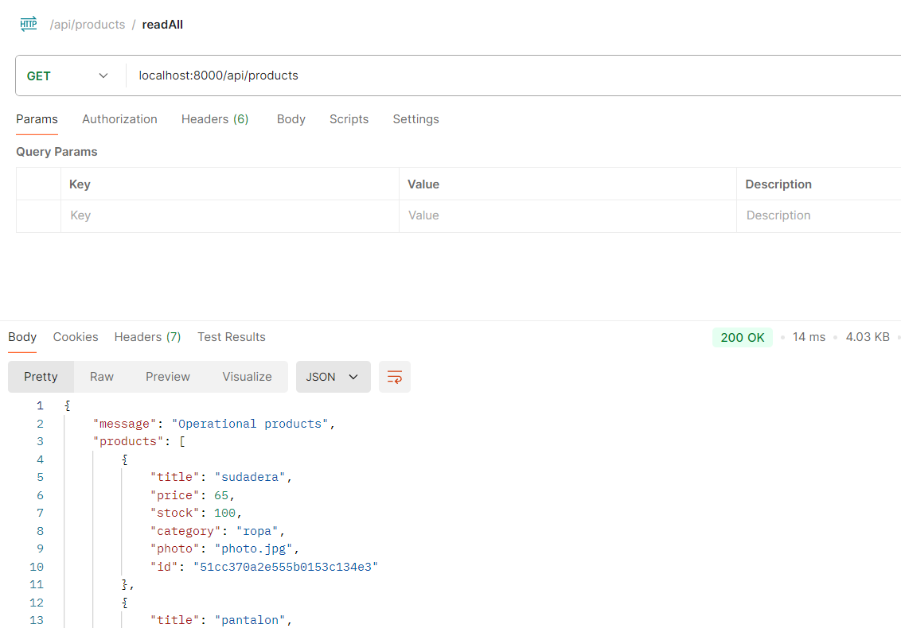
    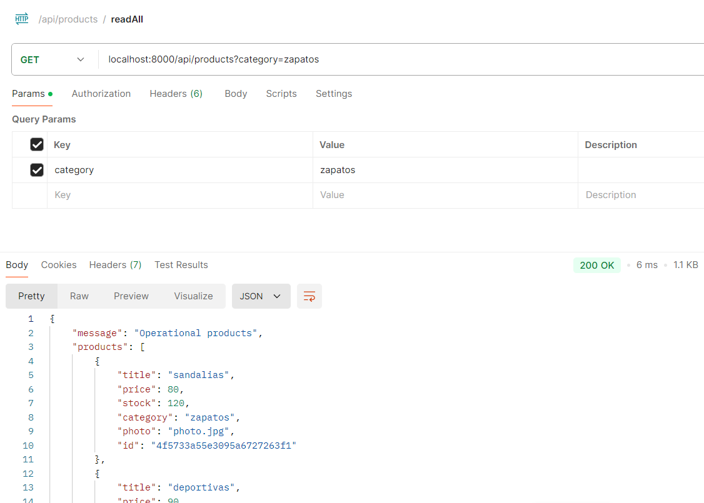

    - url : localhost:8000/api/users o si se quiere filtrar por role localhost:8000/api/users?role=user
    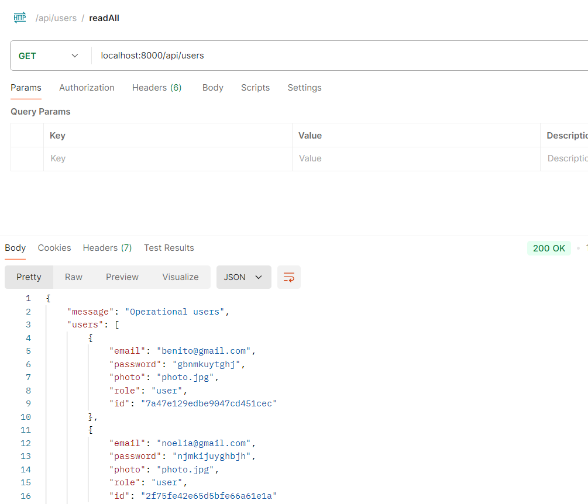
    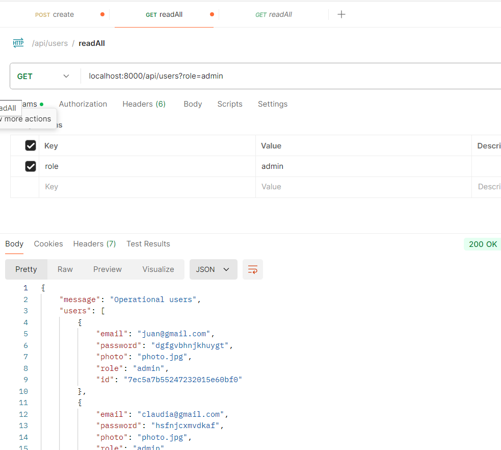


2. Crear una nueva petición GET para método **readOneProducts** y **readOneUsers**

    - url : localhost:8000/api/products/:pid y poner el id del producto en params
    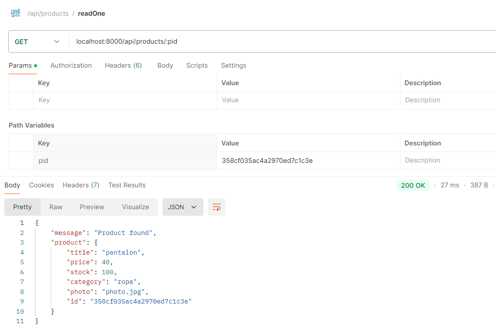
    - url : localhost:8000/api/users/:uid y poner el id del usuario en params
    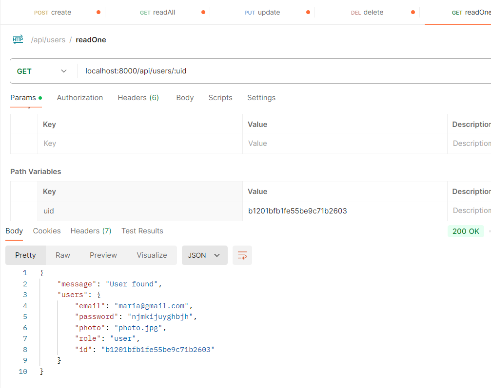

3. Crear una nueva petición POST para método **createProducts** y **createUsers**

    - url : localhost:8000/api/products, luego seleccionar el método POST y enviar el body con los datos de la nueva producto
    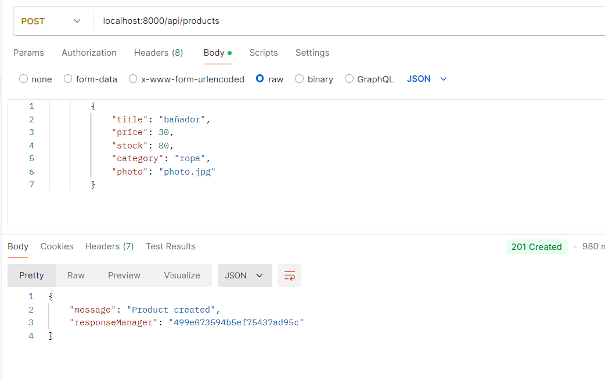
    y si el producto no tiene los parametros requeridos, se devuelve el error 400
    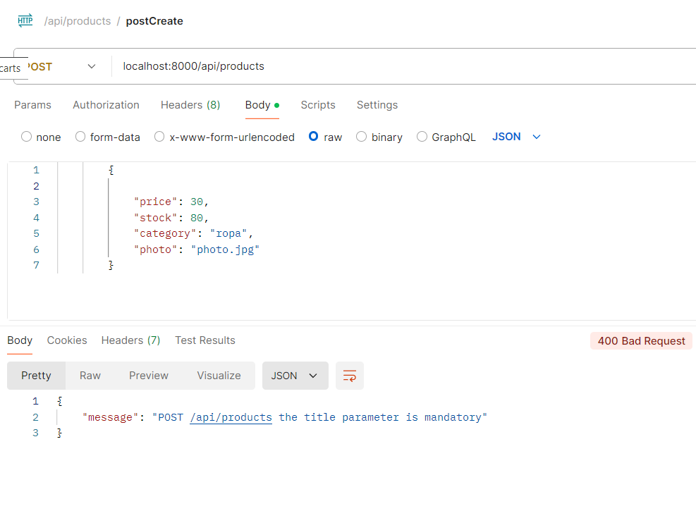

    - url : localhost:8000/api/users, luego seleccionar el método POST y enviar el body con los datos de la nueva usuario
    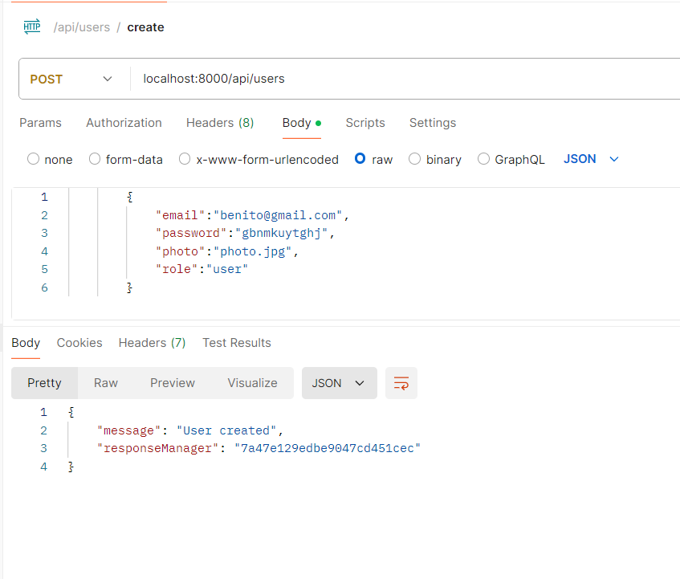
    y si el usuario no tiene los parametros requeridos, se devuelve el error 400
    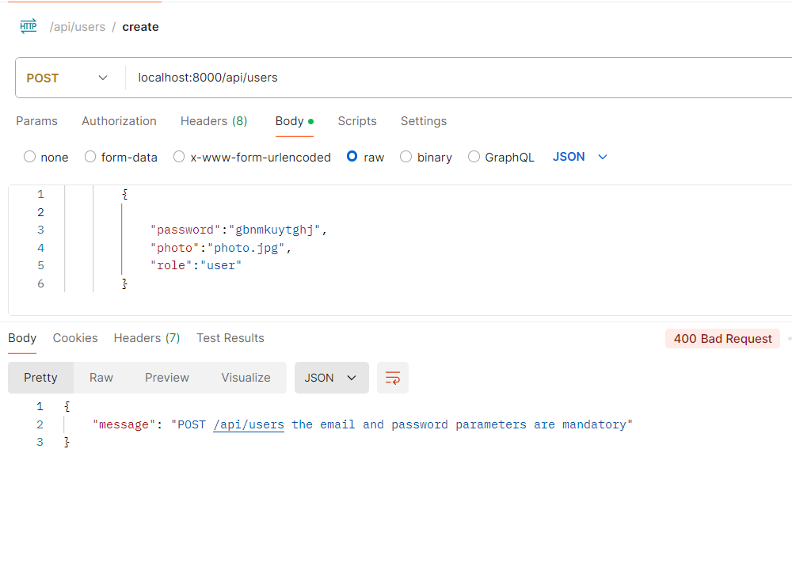

4. Crear una nueva petición PUT para método **updateProducts** y **updateUsers**

    - url : localhost:8000/api/products/:pid  luego seleccionar el método PUT, en params agregar el id del producto y enviar el body con los datos de la nueva producto
    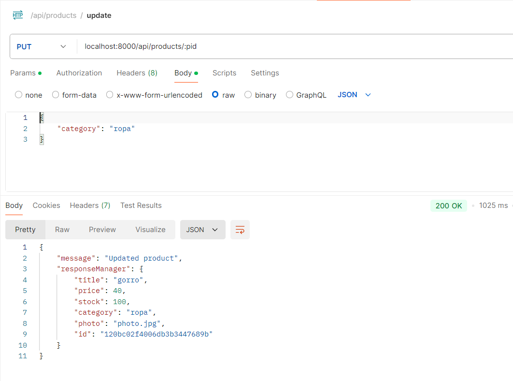

    - url : localhost:8000/api/users/:uid  luego seleccionar el método PUT, en params agregar el id del usuario y enviar el body con los datos de la nueva usuario
    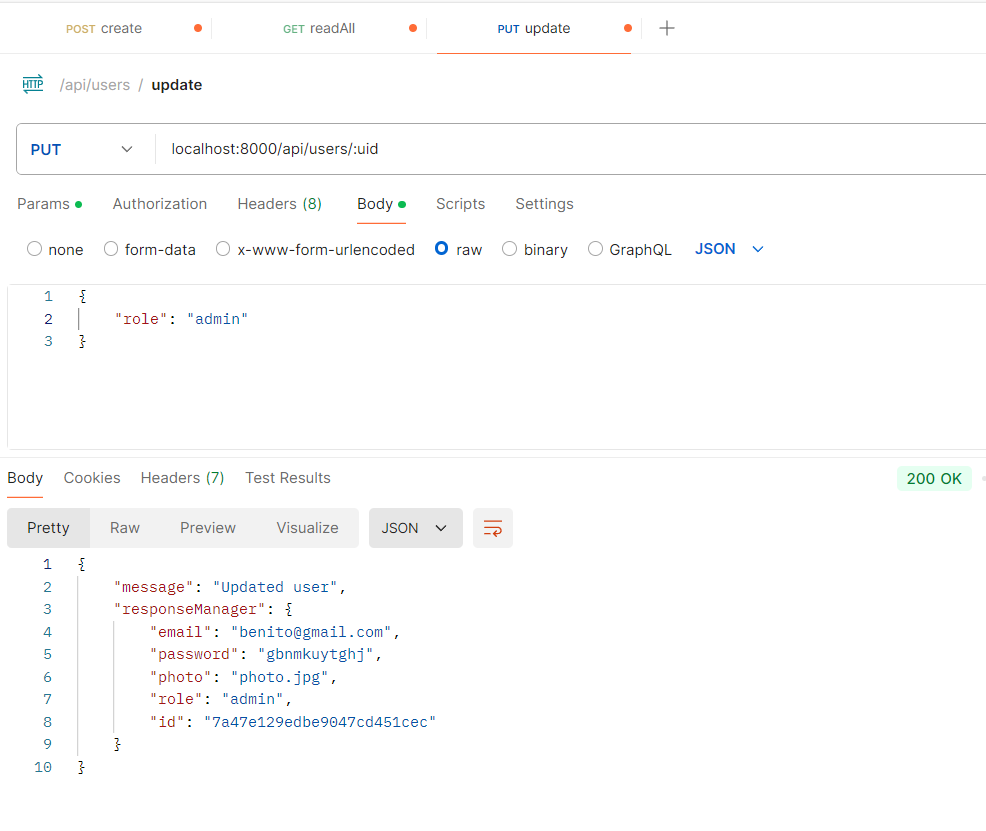

5. Crear una nueva petición DELETE para método **destroyProduct** y **destroyUsers**

    - url : localhost:8000/api/products/:pid y poner el id del producto en params
    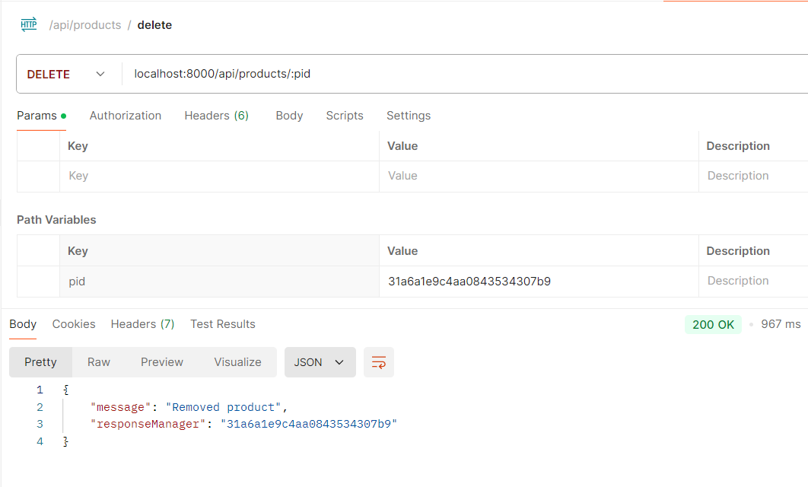

    - url : localhost:8000/api/users/:uid y poner el id del usuario en params
    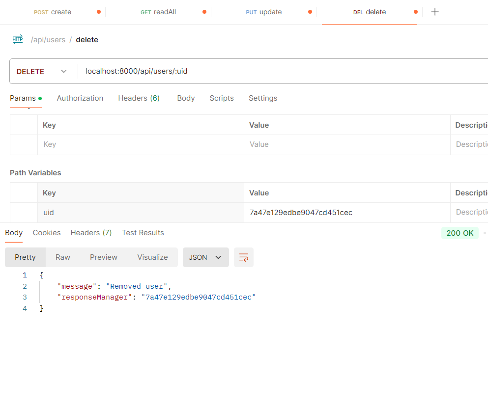


   